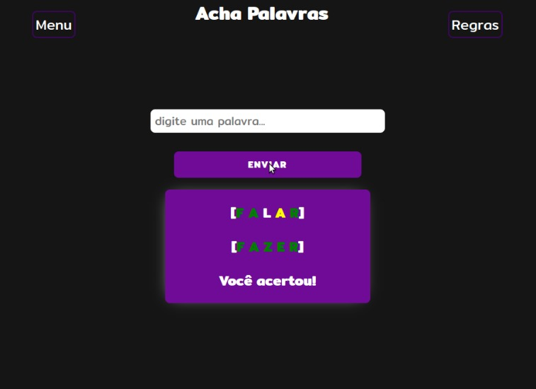

# Bem vindo ao nosso projeto de LPF! 
## Ele foi desenvolvido em Kotlin, utilizando-se do paradigma funcional majoritariamente.

<p align="justify">Esse é um jogo de adivinhação. É gerada uma palavra aleatória de 5 letras, e seu objetivo é acertá-la o mais rápido possível! Para jogar, você deve digitar a palavra que você acha que está correta, e o jogo lhe dirá se você acertou a palavra secreta ou não. Caso sua palavra possua alguma letra correspondente na palavra secreta, e ela esteja na mesma posição em ambas, essa letra será marcada em verde. Caso a sua palavra possua alguma letra correspondente na palavra secreta, mas esteja em uma posição diferente, ela
será marcada em amarelo e, caso não possua nenhuma correspondência, não será marcada. Assim, você terá chances limitadas para acertar a palavra secreta.</p>

Boa sorte e divirta-se!




Para compilar o projeto utilize os seguintes comandos:

(Backend)

Compila o servidor Web:
```
kotlinc -cp ktor.jar:. servidor.kt
```

Executa o servidor Web:
```
kotlin -cp ktor.jar:. ServidorKt
```

(FrontEnd)

Compila o kotlin para JavaScript (KotlinJS):
```
kotlinc-js script.kt -output files/js/script.js
kotlinc-js pontuacao.kt -output files/js/pontuacao.js
```

<h3>Projeto LPF - 2021.2</h3>

<span> Equipe do Projeto: </span>
<ul>
    <li>Antonio Henrique Gomes Pereira de Sousa</li>
    <li>Antonio Tito Sales do Monte  Junior</li>
    <li>Gabriel Pereira da Silva</li>
    <li>Riquelme Lopes da Silva</li>
<ul>
